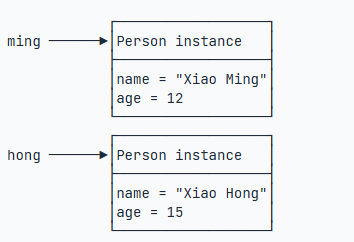

# 面向对象编程

Java是一种面向对象的编程语言。面向对象编程，英文是Object-Oriented Programming,简称OOP.

与面向对象编程不同的，是面向过程编程。面向过程编程，是将模型分解为一步一步的过程。比如一个老板告诉你，要编写一个TODO任务，必须按照以下步骤一步一步来：

1. 读取文件
2. 编写TODO
3. 保存文件

面向对象编程，顾名思义，你得首先有个对象：

    GirlFriend gf = new GirlFriend();
    gf.name = "alice";
    gf.send = ("flowers");

其实就是由现实世界的一种思想方法抽象到计算机模拟的一种编程方法。

## 面向对象基础

面向对象编程，是一种通过对象的方式，将现实世界映射到计算机模型的一种编程方法。

在现实世界中，我们定义了一个“人”的这种抽象概念，而具体的人则是"小明"、"小红"等等，一个个具体的人。所以，在现实世界中，我们可以将"人"定义为一个`类(class)`, 而具体的人则是`实例(instance)`。

**class和instance**

所以，只要了解了**class**和**instance**的概念，基本上就明白了什么是**面向对象编程**。

class是一种对象模板，它定义了如何创建实例，因此，class本身就是一种数据类型。

而instance是对象实例，instance是根据class创建的实例，可以创建多个instance，每个instance类型相同，但各自的属性可能不相同。

**定义class**

在Java中，创建一个类，例如，将这个类命名为`Persin`，就是定义一个`class`:

    class Person{
        public String name;
        public int age;
    }

一个`class`可以包含多个字段(`field`), 字段用来描述一个类的特征。上面的`Person`类，我们就定义了两个字段，一个是`String`类型的字段，命名为`name`, 一个是`int`类型的字段，命名为`age`。因此，可以通过`class`，把一组数据汇集到一个对象上，实现对数据的封装。

`public`是用来修饰字段的，它表示这个字段可以被外部访问。

我们再来看另一个例子：

    class Book {
        public String name;
        public String author;
        public String isbn;
        public double price;
    }

请指出以上的`Book`类的字段有哪些？

**创建实例**

定义了class, 只是定义了对象模板，而要根据对象模板创建出真正的对象实例，必须使用new运算符。

new运算符可以创建一个实例，之后，我们需要定义一个引用类型的变量来指向这个实例：

    Person ming = new Person();

上述代码创建了一个Person类型的实例，并通过`ming`指向它。

上述赋值运算符的两侧，一个是定义`Person`类型的变量`ming`，一个是创建`Person`类型的实例。

有了指向这个实例的变量，我们就可以通过这个变量来操作实例。访问实例变量可以用`变量.字段`，例如：

    ming.name = "xiao ming";
    ming.age = 12;
    System.out.println(ming.name);

    Person hong = new Person();
    hong.name = "xiao hong"
    hong.age = 15;

上述两个变量分别指向两个不同的实例，

上面两个`instance`都有`class`定义的`name`和`age`字段，且各自都有一份独立的数据，互不干扰。

**注意**：一个Java源文件可以包含多个类的定义，但只是定义一个public类，且public类名必须与文件名一致。如果要定义多个public类，必须拆到多个Java源文件中。

练习：请定义一个City类，该class具有如下字段：

- name:名称， String类型
- latitude:纬度，double类型
- longitude:经度，double类型

实例化几个city并赋值，然后打印。

    public class Main{
        public static void main(String[] args) {
            City bj = new City();
            bj.name = "Beijing";
            bj.latitude = 39.903;
            bj.longitude = 116.401;
            System.out,println(bj.name);
            System.out,println("location: " + bj.latitude + ", " + bj.longitide);
        }
    }

    class City {
        public String name;
        public double latitude;
        public double longitude;
    }

**小结**

- 在OOP中，`class`和`instance`是**模板**与**实例**的关系；
- 定义`class`就是定义了一种数据类型，对应的`instance`就是这种数据类型的实例；
- `class`定义的`field`，在每个`instance`都会拥有各自的`field`，且互不干扰。
- 通过`new`操作符创建新的`instance`，然后用变量指向它，即可以通过变量来引用这个`instance`;
- 访问实例字段的方法是`变量名.字段名`;
- 指向`instance`的变量都是引用变量。

## 方法

一个`class`可以包含多个`field`，例如，我们给`Person`类就定义了两个`field`：

    class Person {
        public String name;
        public int age;
    }

但是，直接把`field`用`public`暴露给外部可能会破坏封装性。比如，

    Person ming = new Person();
    ming.name = "xiao ming";
    ming.age = -99;

显然，直接操作`field`，容易造成逻辑混乱。为了避免外部代码直接去访问`field`，我们可以用`private`修饰`field`，拒绝外部访问：

    class Person{
        private String name;
        private int age;
    }

好的，现在我们来试试`private`修饰的`field`有什么效果：

    public class Main {
        public static void main(String[] args){
            Person ming = new Person();
            ming.name = "xiao ming";
            ming.age = 12;
        }
    }

    class Person {
        private String name;
        private int age;
    }

是不是编译报错？把访问`field`的赋值语句去了就可以正常编译了。

当我们将`field`从`public`改成`private`，外部代码不能直接访问这些field，跟我们定义这些`field`有什么用？怎么样才能给它赋值呢？怎么样才能读取它的值？

所以我们需要使用方法（`method`）来让外部代码可以间接修改`field`:

    public class Main {
        public static void main(String[] args) {
            Person ming = new Person();
            ming.setName("xiao ming");
            ming.setAge(12);
            System.out.println(ming.getName() + ", " + ming.getAge());
        }
    }

    class Person {
        private String name;
        private int age;

        public String getName() {
            return this.name;
        }

        public void setName(String name) {
            this.name = name;
        }

        public int getAge() {
            return this.age;
        }

        public void setAge(int age) {
            if (age < 0 || age > 100) {
                throw new IllegalArgumentException("invalid age value");
            }
            this.age = age;
        }
    }

虽然外部代码不能直接修改`private`字段，但是，外部代码可以调用方法`setName()`和`setAge()`来间接修改`private`字段。在方法内部，我们就有机会检查参数对不对。比如，`setAge()`就会检查传入的参数，参数超出了范围，直接报错。这样，外部代码就没有任何机会会把`age`设置成不合理的数值。

对`setName()`方法同样可以做检查，例如，不允许传入`null`和空字符串：

    public void setName(String name) {
        if (name == null || name.isBlank()) {
            throw new IllegalArgumentException("invalid name");
        }
        this.name = name.strip();
    }

同样，外部代码不能直接读取`private`字段，但可以通过`getName()`和`getAge()`间接获取`private`字段的数值。

所以，一个类通过定义方法，就可以给外部代码暴露一些接口的操作，同时，内部自己保证逻辑一致性。

调用方法的语法是`实例方法.方法名(参数);`。一个方法调用就是一个语句，所以不要忘了在末尾加上`;`。例如：`ming.setName("xiao ming");` 。

**定义方法**

从上面的代码中，我们可以看出，定义方法的语法是：

修饰符 方法返回类型 方法名（方法参数列表） {
    若干方法语句;
    return 方法返回值;
}

方法返回值通过`return`语句实现，如果没有返回值，返回类型设置为`void`，可以省略`return`。

**private方法**

有了`public`方法，自然就有`private`方法，和`private`字段一样，`private`方法不允许外部调用，那我们定义`private`方法有什么用呢?

定义`private`方法的理由是内部方法是可以调用`private`方法的，例如：

public class Main {
    public static void main(String[] args) {
        Person ming = new Person();
        ming.setBirth(2008);
        System.out.println(ming.getAge());
    }
}

class Person {
    private String name;
    private int birth;

    public void setBirth(int birth) {
        this.birth = birth;
    }

    public int getAge() {
        return calcAge(2019);
    }

    private int calcAge(int currentYear) {
        return currentYear - this.birth;
    }
}

观察上述代码，`calcAge()`是一个`private`方法，外部代码无法调用，但是，内部方法`getAge()`可以调用它。

此外，我们还注意到，这个`Person`类只定义了`birth`字段，没有定义`age`字段，获取`age`时，通过方法`getAge()`返回的是一个实时计算的数值，而不是存储在某个字段的值。这说明方法可以封装一个类的对外接口，调用方法不需要知道也不关心`Person`实例在内部到底有没有`age`字段。

### 